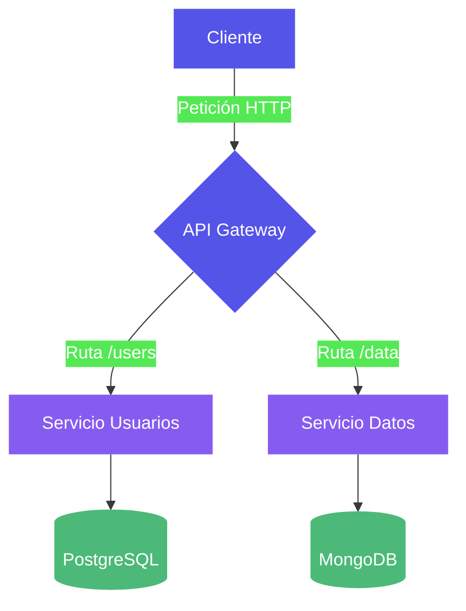
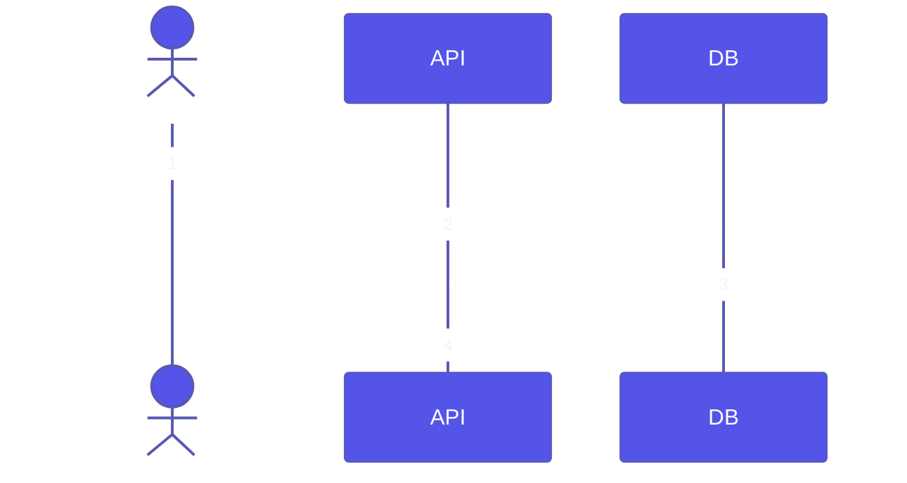
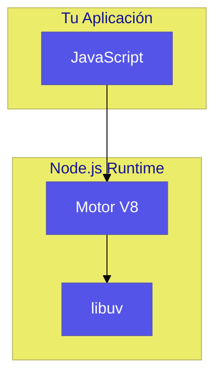
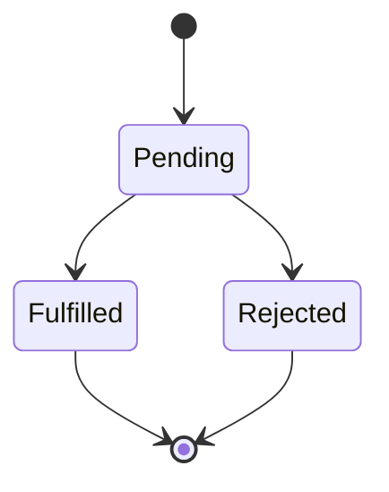

# Skill: `slides-mermaid-diagrams`

Este workflow explica cómo generar diagramas Mermaid (flowcharts, secuencias, arquitectura) y embeberlos como imágenes SVG o PNG en las diapositivas Beamer de la Universidad Icesi.

---

### Sección 1: Herramienta y Motor

Para compilar archivos `.mmd` a imágenes `.svg` o `.png`, utilizamos la herramienta de línea de comandos `mmdc` (`@mermaid-js/mermaid-cli`).

**Para compilar a PNG directamente:**
```bash
npx -y @mermaid-js/mermaid-cli -i slides/<tema>/assets/<nombre>.mmd -o slides/<tema>/assets/<nombre>.png --backgroundColor transparent --width 800 --height 500
```

**Para compilar a SVG primero:**
```bash  
npx -y @mermaid-js/mermaid-cli -i slides/<tema>/assets/<nombre>.mmd -o slides/<tema>/assets/<nombre>.svg --backgroundColor transparent
```

Luego, si es necesario, convertir el SVG a PNG con alta resolución usando `svgexport`:
```bash
npx svgexport slides/<tema>/assets/<nombre>.svg slides/<tema>/assets/<nombre>.png 2x
```

---

### Sección 2: Paleta de Colores Icesi para Mermaid

Los diagramas deben adaptarse a los colores de marca de la Universidad Icesi. Puedes definir un archivo de configuración Mermaid (`mermaid-config.json`) con el siguiente tema personalizado:

```json
{
  "theme": "base",
  "themeVariables": {
    "primaryColor": "#5454E9",
    "secondaryColor": "#865CF0",
    "tertiaryColor": "#4CB979",
    "primaryTextColor": "#FFFFFF",
    "lineColor": "#393939"
  }
}
```

Para usar esta configuración en el comando:
```bash
npx -y @mermaid-js/mermaid-cli -i entrada.mmd -o salida.png --configFile mermaid-config.json --backgroundColor transparent
```

Alternativamente, puedes usar directivas y `classDef` directamente dentro del `.mmd` para aplicar los colores a los nodos individuales.

---

### Sección 3: Tipos de Diagramas y Sus `.mmd`

A continuación, ejemplos completos de código `.mmd` para diferentes tipos de diagramas:

**A. Diagrama de Flujo (Flowchart)**:


**B. Diagrama de Secuencia**:


**C. Diagrama de Arquitectura (Subgraphs)**:


**D. Diagrama de Estado / Ciclo de Vida**:


---

### Sección 4: Embedding en LaTeX

Ejemplos de cómo usar las imágenes generadas dentro de las macros del layout de Icesi:

**En un slide con sidebar:**
```latex
\slideSidebarLeftBlue{Arquitectura}{
    \begin{itemize}
        \item Explicación del diagrama.
        \item Detalle técnico.
    \end{itemize}
}{slides/<tema>/assets/diagrama.png}
```

**En un slide de dos columnas:**
```latex
\slideTwoCols{Diagrama de Secuencia}{
    \begin{itemize}
        \item Paso 1: Login
        \item Paso 2: Consulta
    \end{itemize}
}{
    \includegraphics[width=\textwidth,keepaspectratio]{slides/<tema>/assets/secuencia.png}
}
```

**En un banner decorativo:**
```latex
\slideStripeTopLeft{Ciclo de Vida}{
    \begin{center}
        \includegraphics[width=0.8\textwidth]{slides/<tema>/assets/estado.png}
    \end{center}
}
```

---

### Sección 5: Reglas de Calidad Visual

- Ancho máximo del PNG exportado para sidebar: `800px`
- Para slides de contenido full: `1200px`
- Fondo siempre transparente (`--backgroundColor transparent`)
- Verificar visibilidad a tamaño de diapositiva con el PNG de preview (debe ser legible sin hacer zoom).
