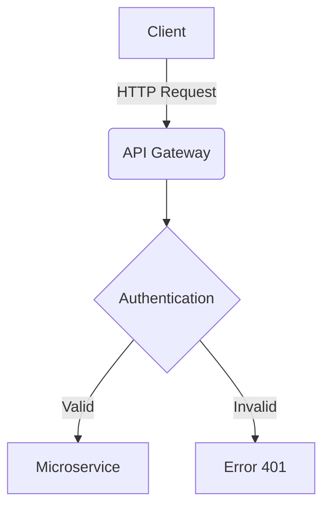

# Skill: `slides-mermaid-diagrams` (Mermaid CLI to SVG)

This workflow explains how to generate **Mermaid.js** diagrams for Universidad Icesi HTML slides. 
Due to limitations in PDF export (Decktape), we **DO NOT** use inline `icesi.mermaid(...)` JavaScript at runtime. 
Instead, we pre-compile `.mmd` files into static `.svg` images.

---

### Workflow for Generating Mermaid Diagrams

**Step 1: Create a Mermaid file (`.mmd`)**
Write your Mermaid code into a file inside the assets folder:
`slides/<topic>/assets/diagram1.mmd`

Example `diagram1.mmd`:


**Step 2: Compile to SVG via CLI**
Use `mermaid-cli` to compile the `.mmd` file to a `.svg` file with a transparent background:
```bash
npx -y @mermaid-js/mermaid-cli -i slides/<topic>/assets/diagram1.mmd -o slides/<topic>/assets/diagram1.svg -b transparent
```

**Step 3: Embed in HTML Presentation**
Do NOT use `icesi.mermaid(...)`. Instead, treat the generated SVG as a standard image or vector graphic in your component calls:

*Option A: As an image string (for simple layouts)*
```javascript
icesi.sectionSlideB('Architecture', 'assets/diagram1.svg')
```

*Option B: Inline as graphic (for sidebars or complex layouts)*
If using sidebars (`slideSidebarLeftOrange`), you can inject it wrapped in the graphic type:
```javascript
// Read the generated SVG file content
const diag1Svg = fs.readFileSync('slides/<topic>/assets/diagram1.svg', 'utf8');

icesi.slideSidebarLeftOrange(
  'Architecture Flow',
  '<p>Explanation here...</p>',
  { type: 'graphic', html: diag1Svg } // Inject raw SVG
)
```

---

### Visual Guidelines for Mermaid
- **Colors**: Rely on the default Mermaid themes or explicitly style nodes with Icesi colors (`#5454E9` blue, `#E9683B` orange, `#4CB979` green, `#865CF0` purple).
- **Scale**: The SVG will automatically scale. If you inject it directly via `{type: 'graphic'}`, ensure the parent container `.section-content` or `.sidebar-graphic` handles the `max-width: 100%`.

